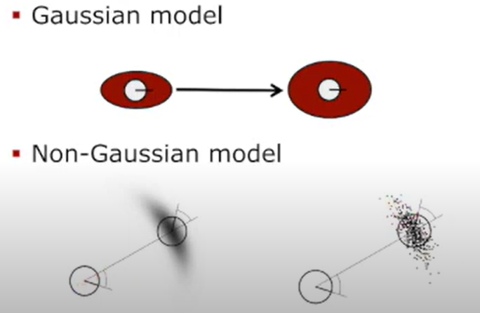
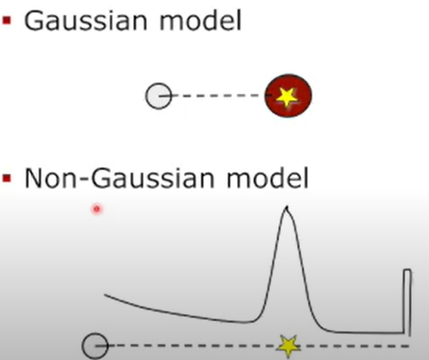

# SLAM
> SLAM DUNK [[link](https://www.youtube.com/watch?v=d1TvU_jvMsE&list=PLubUquiqNQdP_H6uUmU-9f0y_LheA3Hil&ab_channel=SLAMKR)]

### Localization
* robot motion(noisy)
* landmarks
* estimate robot pose based on motion and landmark observations
    * 랜드마크가 정확하다는 가정하에 motion을 보정

### Mapping
* robot motion
* sensor readings(noisy)
* estimate landmarks(i.e. map points), based on motion and sensor readings
    * 모션이 정확하다는 가정하에 landmarks 위치를 보정

### SLAM
* noise robot motion
* noise sensor reading
* estimate robot position and landmarks, based on motion and sensor reading
* 'Loop closure'를 수행하면 지금까지 쌓인 에러를 해결 할 수 있다.
* Mobile robot, 'Autonomous cars'(localisation만 필요 해질 수 있으므로)?
* Offline SLAM : Sensor data를 다 모아서 맵을 생성
* Online SLAM : 일반적으로 생각하는 실시간 SLAM
* 물체의 트레젝토리와 맵의 확률 표현 식:
$$p(x_{0:T},m | z_{1:T}, u_{1:T})$$
$$distribution(path_{0:T},map/given/observations_{1:T}, controls_{1:T})$$

* Full SLAM: estimates the entire path. 
    * SfM(Structure From the Motion) : 모은 경로와 모은 맵 포인트를 추정
$$p(x_{0:T},m | z_{1:T}, u_{1:T})$$
* Online SLAM: seeks to recover only the most recent pose
    * Filter-based SLAM : 가장 최근 포즈만 추정
$$p(x_t,m | z_{1:t}, u_{1:t})$$

> 현대의 SLAM에서는 명확히 Full/Online SLAM을 구분하기는 어렵다.

### SLAM이 왜 어려운가?

* Uncertainties 
    * 모션과 랜드마크의 위치들이 모두 부정함
    * 어떤 랜드마크를 보고있는지 확실 할 수 없다

### SLAM을 어떻게 풀었나?

* Kalman filter : Kalman filter를 이용해 맵의 포인트와 로봇 포즈를 추정
* Particle filter : 가우시안을 이용해서 추정
* Graph-based
    * Least squared formulation of the SLAM problem : 리스트 스퀘어를 사용해 SLAM 문제를 해결

### Motion model / Observation model

* Motion model
$$p(x_t|x_{t-1}, ut)$$
$$distribution(new pose/given/old pose, control)$$

* Observation model
$$p(z_t|x_t)$$
$$p(observation/given/pose)$$

